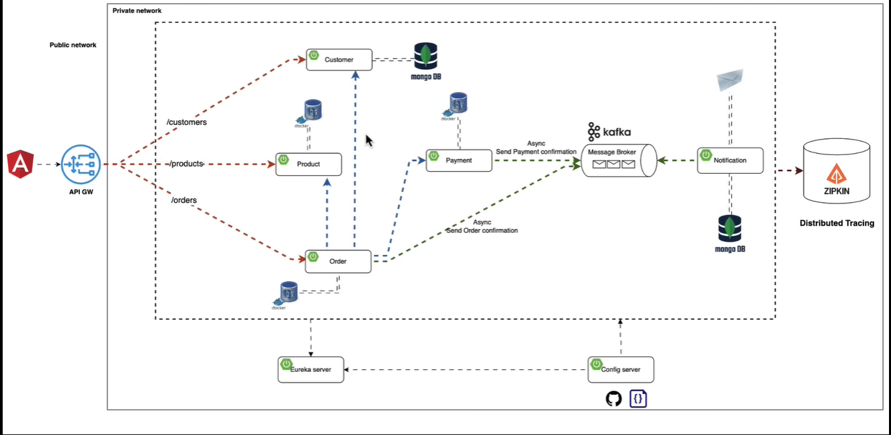

# E-Commerce Microservices Project

## Description
This project is an advanced e-commerce application designed using a microservices architecture. It leverages modern technologies to ensure scalability, reliability, and maintainability. The project aims to provide a robust platform for managing e-commerce activities, including product listings, orders, and user management.

## Technologies Used
- **Microservices Architecture**
- **Spring 3 & Spring Cloud**
- **Kafka**
- **MongoDB**
- **ZIPKIN**
- **API Gateway**
- **Docker**
- **TDD (Test-Driven Development)**

## Features
- **Product Management**
- **Order Processing**
- **User Management**
- **Scalable Architecture**
- **Event-Driven Communication**
- **Centralized Logging and Monitoring**

## Installation Instructions
1. **Clone the repository**:
    ```bash
    git clone https://github.com/devsukransinci/Online-Shopping-Portal.git
    cd Online-Shopping-Portal
    ```

2. **Build and run the Docker containers**:
    ```bash
    docker-compose up --build
    ```

3. **Access the application**:
    - The API Gateway will be accessible at `http://localhost:8080`
    - Other services will be accessible through their respective endpoints via the API Gateway.

## Usage
1. **Product Management**:
    - Add new products via POST requests to `/api/products`
    - Fetch products via GET requests to `/api/products`
    - Update or delete products via PUT/DELETE requests to `/api/products/{id}`

2. **Order Processing**:
    - Create new orders via POST requests to `/api/orders`
    - Fetch orders via GET requests to `/api/orders`
    - Update order status via PUT requests to `/api/orders/{id}`

3. **User Management**:
    - Register new users via POST requests to `/api/users`
    - Authenticate users via POST requests to `/api/auth/login`
    - Manage user profiles via GET/PUT requests to `/api/users/{id}`

## Contributors
- **Sukran Sinci**: Project Creator and Lead Developer

## License
This project is licensed under the MIT License - see the [LICENSE](LICENSE) file for details.

## Links
- **Live Demo**: [Link to live demo if available]
- **Documentation**: [Link to additional documentation if available]
