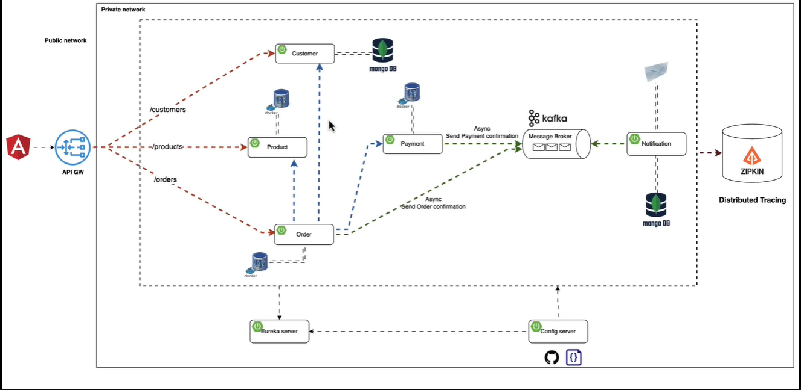

# 🛒 E-Commerce Microservices Project

## 📌 About

A cloud-native, microservices-based e-commerce platform built for scalability, modularity, and real-world applicability. This project handles core e-commerce functionalities such as product management, user services, and order processing, with a focus on event-driven communication, observability, and fault tolerance.

## 🚀 Tech Stack

- **Spring Boot 3 & Spring Cloud**
- **Microservices Architecture**
- **Apache Kafka** (asynchronous messaging)
- **MongoDB** (NoSQL database)
- **Zipkin** (distributed tracing)
- **API Gateway** (routing and authentication)
- **Docker & Docker Compose** (containerization)
- **TDD** (Test-Driven Development)

## ⚙️ Features

- 🛍️ **Product Service** – Create, update, delete, and fetch products  
- 📦 **Order Service** – Place and manage orders, with status tracking  
- 👤 **User Service** – Registration, authentication, and user profile management  
- ⚡ **Kafka Integration** – Event-driven communication between services  
- 🔍 **Centralized Logging & Monitoring** – Using Zipkin for request tracing  
- 🔧 **API Gateway** – Central entry point for routing and load balancing  
- 🧪 **TDD-Based Development** – Ensuring quality and reliability

## Installation Instructions

1. **Clone the repository**:
    ```bash
    git clone https://github.com/devsukransinci/Online-Shopping-Portal.git
    cd Online-Shopping-Portal
    ```

2. **Build and run the Docker containers**:
    ```bash
    docker-compose up --build
    ```

3. **Access the application**:
    - The API Gateway will be accessible at `http://localhost:8080`
    - Other services will be accessible through their respective endpoints via the API Gateway.

## Usage
1. **Product Management**:
    - Add new products via POST requests to `/api/products`
    - Fetch products via GET requests to `/api/products`
    - Update or delete products via PUT/DELETE requests to `/api/products/{id}`

2. **Order Processing**:
    - Create new orders via POST requests to `/api/orders`
    - Fetch orders via GET requests to `/api/orders`
    - Update order status via PUT requests to `/api/orders/{id}`

3. **User Management**:
    - Register new users via POST requests to `/api/users`
    - Authenticate users via POST requests to `/api/auth/login`
    - Manage user profiles via GET/PUT requests to `/api/users/{id}`

## Contributors
- **Sukran Sinci**: Project Creator and Lead Developer
